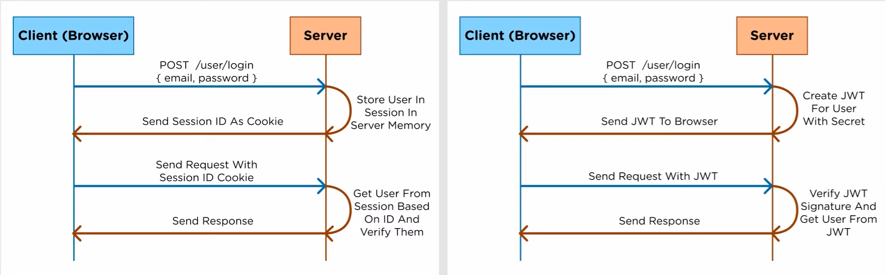

<div align="center">
    
    <h1> Web Security Handbook </h1>
</div>

This repository was created with the intention of providing developers with insights, best practices, and practical examples to help you navigate the complex landscape of web security. Secure your web applications with confidence using the knowledge shared in this handbook.

# Table Of Contents

- [Cookies](#cookies)
  - [What are cookies on websites?](#what-are-cookies-on-websites)
  - [Where are cookies stored?](#where-are-cookies-stored)
  - [What are cookies used for?](#what-are-cookies-used-for)
  - [What are the different types of cookies?](#what-are-the-different-types-of-cookies)
  - [How do cookies affect the user privacy?](#how-do-cookies-affect-the-user-privacy)
  - [HTTP Cookies: Pros and Cons](#http-cookies-pros-and-cons)
- [Web Storage](#web-storage)
  - [What is the Session Storage Object?](#what-is-the-session-storage-object)
  - [What is the Local Storage Object?](#what-is-the-local-storage-object)
  - [What are Web Storage’s Built-In Interfaces?](#what-are-web-storages-built-in-interfaces)
- [Cross-Origin Resource Sharing](#cross-origin-resource-sharing)
  - [What is Cross-Origin Resource Sharing?](#what-is-cross-origin-resource-sharing)
  - [Why is cross-origin resource sharing important?](#why-is-cross-origin-resource-sharing-important)
  - [How does cross-origin resource sharing work?](#how-does-cross-origin-resource-sharing-work)
  - [What is a CORS preflight request?](#what-is-a-cors-preflight-request)
  - [What is the difference between CORS and JSONP?](#what-is-the-difference-between-cors-and-jsonp)
  - [What are some CORS best practices?](#what-are-some-cors-best-practices)
  - [How can AWS support your CORS requirements?](#how-can-aws-support-your-cors-requirements)
- [JWT](#jwt)
  - [What is JWT?](#what-is-jwt)
  - [How it works?](#how-it-works)
  - [Why you should use JWT?](why-you-should-use-jwt)

Sources:

- [AWS - What is CORS?](https://aws.amazon.com/what-is/cross-origin-resource-sharing)
- [Web Storage Explained – How to Use localStorage and sessionStorage in JavaScript Projects](https://www.freecodecamp.org/news/web-storage-localstorage-vs-sessionstorage-in-javascript/#web-storage-vs-cookies-what-is-the-difference)

# Cookies

### What are cookies on websites?

Cookes are small files that allow websites to remember information about you. An HTTP cookie, also known as a “web cookie,” “browser cookie,” or simply “cookie,” is a small piece of data that a server sends to a user’s web browser. After being received and stored on the browser, cookies are sent back to the server with each request. HTTP cookies generally contain information about the user’s activity and help maintain session state between different browsing sessions.

Keep in mind that HTTP is a stateless protocol. That means that the server treats each request as a stand-alone operation and has no memory of previous requests from the same user. Thus, it is necessary to send additional information with each request to maintain the state of a user’s session. This is exactly what cookies are about.

Specifically, the cookie mechanism starts when a website’s server returns an HTTP response with a Set-Cookie header. This header contains some data and an expiration date. When the browser receives a response involving a Set-Cookie header, it can store the cookie data in a text file or keep it in memory. Now, when the user visits a page on that website, the browser will send the cookie back to the server in the Cookie header of the request.

Cookies play a key role when it comes to providing a more personalized experience, maintaining login sessions, and tracking users. HTTP Cookies can also be used for security and authorization purposes.

### Where are cookies stored?

Web browsers store cookies in a designated file on users' devices hard drive. The Google Chrome web browser, for instance, stores all cookies in a file labeled "Cookies." Chrome users can view the cookies stored by the browser by opening developer tools, clicking the "Application" tab, and clicking on "Cookies" in the left side menu.

### What are cookies used for?

**State/Session Management**

HTTP cookies are used by websites to remember information about a user’s session. This information includes login sessions, search filters, the scroll position on a long page, and more. For example, when a user adds items to their shopping cart on an eCommerce website, this info is stored in a cookie. When the user closes the browser or visits another page, that valuable data is not lost but remains safe in the cookie saved on the disk.

**Personalization**

Cookies can be used to store user preferences, such as preferred language, font size, and selected colors. This information is critical to personalizing the user’s experience on the website, making it more enjoyable and accessible.

**Tracking Users**

Cookies allow tracking the behavior of a user on a website, such as which pages they visit, how long they stay on a page, and which links they click on. This data can be studied to improve the overall user experience, adapting the content or layout of pages accordingly. Also, cookies are useful for collecting analytics data. For example, Google Analytics collects data and reports site usage statistics through a set of cookies.

### What are the different types of cookies?

As you just learned, HTTP cookies are useful in a variety of circumstances. As a result, there are many different types of cookies. Let’s take a look at the most important ones:

- _Session cookies:_ Are temporary and stored in memory by the browser. They only exist until the user closes their web browser. They are used to remember information about the user’s current browsing session on a website.

- _Persistent cookies:_ They are stored on the user’s hard drive and persist even after the web browser is closed. They are typically used to remember user preferences and maintain login sessions over time.

- _First-party cookies:_ Are set by the website that the user is visiting and are used to remember information about the user’s session and preferences.

- _Third-party cookies:_ Are set by a different website than the one the user is visiting and are generally used for advertising or tracking purposes. Examples are cookies from Google Analytics, Facebook.

### How do cookies affect the user privacy?

As described above, cookies can be used to record browsing activity, including for advertising purposes. However, many users do not want their online behavior to be tracked. Users also lack visibility or control over what tracking services do with the data they collect.

Even when cookie-based tracking is not tied to a specific user's name or device, with some types of tracking it could still be possible to link a record of a user's browsing activity with their real identity. This information could be used in any number of ways, from unwanted advertising to the monitoring, stalking, or harassment of users. (This is not the case with all cookie usage.)

Some privacy laws, like the EU's ePrivacy Directive, address and govern the use of cookies. Under this directive, users have to provide "informed consent" — they have to be notified of how the website uses cookies and agree to this usage — before the website can use cookies. (The exception to this is cookies that are "strictly necessary" for the website to function.) The EU's General Data Protection Regulation (GDPR) considers cookie identifiers to be personal data, so its rules apply to cookie usage in the EU as well. Also, any personal data collected by cookies falls under the GDPR's jurisdiction.

Largely because of these laws, many websites now display cookie banners that allow users to review and control the cookies those websites use.

### HTTP Cookies: Pros and Cons

HTTP cookies are a versatile and powerful tool that covers various needs. However, they also come with some drawbacks to consider. It is time to dig into the main pros and cons of HTTP cookies.

**Pros**

1. Easy to implement and use: Cookies are a simple and effective way for maintaining session state over HTTP.
2. Can be stored on disk: Persistent cookies allow data from the previous browsing session to be retained, even after closing the browser.
3. Can be shared between pages and domains: The same cookie can be used by several pages of the same site and by different subdomains of the same domain.

**Cons**

1. Limited in size and number: Most browsers limit browser size to 4 KB and allow no more than 150 cookies per domain.
2. Can be deleted by users: Cookies can be deleted by users at any time directly in the browser, which can cause problems for websites that rely on them.
3. Security/Privacy risks: Cookies can contain sensitive information about the user and pose a security risk. Additionally, cookies can be used to track and collect data on a user’s behavior, which raises privacy concerns.

# Web Storage

### What is the Session Storage Object?

The read-only sessionStorage property accesses a session Storage object for the current origin. sessionStorage is similar to localStorage; the difference is that while data in localStorage doesn't expire, data in sessionStorage is cleared when the page session ends.

- Whenever a document is loaded in a particular tab in the browser, a unique page session gets created and assigned to that particular tab. That page session is valid only for that particular tab.
- A page session lasts as long as the tab or the browser is open, and survives over page reloads and restores.
- Opening a page in a new tab or window creates a new session with the value of the top-level browsing context, which differs from how session cookies work.
- Opening multiple tabs/windows with the same URL creates sessionStorage for each tab/window.
- Duplicating a tab copies the tab's sessionStorage into the new tab.
- Closing a tab/window ends the session and clears objects in sessionStorage.

Data stored in sessionStorage is specific to the protocol of the page. In particular, data stored by a script on a site accessed with HTTP (e.g., http://example.com) is put in a different sessionStorage object from the same site accessed with HTTPS (e.g., https://example.com).

The keys and the values are always in the UTF-16 string format, which uses two bytes per character. As with objects, integer keys are automatically converted to strings.

### Examples

1. Basic usage

```JavaScript
// Save data to sessionStorage
sessionStorage.setItem("key", "value");

// Get saved data from sessionStorage
let data = sessionStorage.getItem("key");

// Remove saved data from sessionStorage
sessionStorage.removeItem("key");

// Remove all saved data from sessionStorage
sessionStorage.clear();
```

2. Saving text between refreshes

The following example autosaves the contents of a text field, and if the browser is refreshed, restores the text field content so that no writing is lost.

```JavaScript
// Get the text field that we're going to track
let field = document.getElementById("field");

// See if we have an autosave value
// (this will only happen if the page is accidentally refreshed)
if (sessionStorage.getItem("autosave")) {
  // Restore the contents of the text field
  field.value = sessionStorage.getItem("autosave");
}

// Listen for changes in the text field
field.addEventListener("change", () => {
  // And save the results into the session storage object
  sessionStorage.setItem("autosave", field.value);
});
```

### What is the Local Storage Object?

The localStorage read-only property of the window interface allows you to access a Storage object for the Document's origin; the stored data is saved across browser sessions.

localStorage is similar to sessionStorage, except that while localStorage data has no expiration time, sessionStorage data gets cleared when the page session ends — that is, when the page is closed. (localStorage data for a document loaded in a "private browsing" or "incognito" session is cleared when the last "private" tab is closed.)

# Description

The keys and the values stored with `localStorage` are _always_ in the UTF-16 string format, which uses two bytes per character. As with objects, integer keys are automatically converted to strings.

`localStorage` data is specific to the protocol of the document. In particular, for a site loaded over HTTP (e.g., http://example.com), localStorage returns a different object than `localStorage` for the corresponding site loaded over HTTPS (e.g., https://example.com).

For documents loaded from file: URLs (that is, files opened in the browser directly from the user's local filesystem, rather than being served from a web server) the requirements for localStorage behavior are undefined and may vary among different browsers.

In all current browsers, localStorage seems to return a different object for each file: URL. In other words, each file: URL seems to have its own unique local-storage area. But there are no guarantees about that behavior, so you shouldn't rely on it because, as mentioned above, the requirements for file: URLs remain undefined. So it's possible that browsers may change their file: URL handling for localStorage at any time. In fact some browsers have changed their handling for it over time.

### Examples

The following snippet accesses the current domain's local Storage object and adds a data item to it using [Storage.setItem()](https://developer.mozilla.org/en-US/docs/Web/API/Storage/setItem).

```JavaScript
localStorage.setItem("myCat", "Tom");
```

The syntax for reading the localStorage item is as follows:

```JavaScript
const cat = localStorage.getItem("myCat");
```

The syntax for removing the localStorage item is as follows:

```JavaScript
localStorage.removeItem("myCat");
```

The syntax for removing all the localStorage items is as follows:

```JavaScript
localStorage.clear();
```

### What are Web Storage’s Built-In Interfaces?

The web storage built-in interfaces are the recommended tools for reading and manipulating a browser’s ` sessionStorage` and `localStorage` objects.

The six (6) built-in interfaces are:

- [setItem()](https://developer.mozilla.org/en-US/docs/Web/API/Storage/setItem)
- [key()](https://developer.mozilla.org/en-US/docs/Web/API/Storage/key)
- [getItem()](https://developer.mozilla.org/en-US/docs/Web/API/Storage/key)
- [length](https://developer.mozilla.org/en-US/docs/Web/API/Storage/length)
- [removeItem()](https://developer.mozilla.org/en-US/docs/Web/API/Storage/removeItem)
- [clear()](https://developer.mozilla.org/en-US/docs/Web/API/Storage/clear)

# Cross-Origin Resource Sharing

### What is Cross-Origin Resource Sharing?

Cross-origin resource sharing (CORS) is a mechanism for integrating applications. CORS defines a way for client web applications that are loaded in one domain to interact with resources in a different domain. This is useful because complex applications often reference third-party APIs and resources in their client-side code. For example, your application may use your browser to pull videos from a video platform API, use fonts from a public font library, or display weather data from a national weather database. CORS allows the client browser to check with the third-party servers if the request is authorized before any data transfers.

### Why is cross-origin resource sharing important?

In the past, when internet technologies were still new, cross-site request forgery (CSRF) issues happened. These issues sent fake client requests from the victim's browser to another application.

For example, the victim logged into their bank's application. Then they were tricked into loading an external website on a new browser tab. The external website then used the victim's cookie credentials and relayed data to the bank application while pretending to be the victim. Unauthorized users then had unintended access to the bank application.

To prevent such CSRF issues, all browsers now implement the same-origin policy.

**Same-origin policy**

Today, browsers enforce that clients can only send requests to a resource with the same origin as the client's URL. The protocol, port, and hostname of the client's URL should all match the server it requests.

For example, consider the origin comparison for the below URLs with the client URL _http://store.aws.com/dir/page.html_.

| URL                                          | Outcome          | Reason                                         |
| -------------------------------------------- | ---------------- | ---------------------------------------------- |
| _http://store.aws.com/dir2/new.html_         | Same origin      | Only the path differs                          |
| _http://store.aws.com/dir/inner/other.html _ | Same origin      | Only the path differs                          |
| _https://store.aws.com/page.html _           | Different origin | Different protocol                             |
| _http://store.aws.com:81/dir/page.html_      | Different origin | Different port (http:// is port 80 by default) |
| _http://news.aws.com/dir/page.html _         | Different origin | Different host                                 |

So, the same-origin policy is highly secure but inflexible for genuine use cases.

Cross-origin resource sharing (CORS) is an extension of the same-origin policy. You need it for authorized resource sharing with external third parties. For example, you need CORS when you want to pull data from external APIs that are public or authorized. You also need CORS if you want to allow authorized third-party access to your own server resources.

### How does cross-origin resource sharing work?

In standard internet communication, your browser sends an HTTP request to the application server, receives data as an HTTP response, and displays it. In browser terminology, the current browser URL is called the current origin and the third-party URL is _cross-origin_.

When you make a cross-origin request, this is the request-response process:

1. The browser adds an origin header to the request with information about the current origin's protocol, host, and port
2. The server checks the current origin header and responds with the requested data and an Access-Control-Allow-Origin header
3. The browser sees the access control request headers and shares the returned data with the client application

Alternatively, if the server doesn’t want to allow cross-origin access, it responds with an error message.

**Cross-origin resource sharing example**

For example, consider a site called _https://news.example.com_. _This site_ wants to access resources from an API at _partner-api.com_.

Developers at _https://partner-api.com_ first configure the cross-origin resource sharing (CORS) headers on their server by adding new.example.com to the allowed origins list. They do this by adding the below line to their server configuration file.

_Access-Control-Allow-Origin: https://news.example.com_

Once CORS access is configured, news.example.com can request resources from _partner-api.com_. For every request, _partner-api.com \_will respond with \_Access-Control-Allow-Credentials_ : "true." The browser then knows the communication is authorized and permits cross-origin access.

If you want grant access to multiple origins, use a comma-separated list or wildcard characters like \* that grant access to everyone.

### What is a CORS preflight request?

In HTTP, request methods are the data operations the client wants the server to perform. Common HTTP methods include _GET, POST, PUT, and DELETE_.

In a regular cross-origin resource sharing (CORS) interaction, the browser sends the request and access control headers at the same time. These are usually _GET_ data requests and are considered low-risk.

However, some HTTP requests are considered complex and require server confirmation before the actual request is sent. The preapproval process is called _preflight request_.

**Complex cross-origin requests**

Cross-origin requests are complex if they use any of the following:

- Methods other than GET, POST, or HEAD
- Headers other than Accept-Language, Accept, or Content-Language
- Content-Type headers other than multipart/form-data, application/x-www-form-urlencoded, or text/plain

So, for example, requests to delete or modify existing data are considered complex.

**How preflight requests work**

Browsers create preflight requests if they are needed. It's an _OPTIONS_ request like the following one.

```Text
OPTIONS /data HTTP/1.1

Origin: https://example.com

Access-Control-Request-Method: DELETE
```

The browser sends the preflight request before the actual request message. The server must respond to the preflight request with information about the cross-origin requests the server’s willing to accept from the client URL. The server response headers must include the following:

- Access-Control-Allow-Methods
- Access-Control-Allow-Headers
- Access-Control-Allow-Origin

An example server response is given below.

```Text
HTTP/1.1 200 OK

Access-Control-Allow-Headers: Content-Type

Access-Control-Allow-Origin: https://news.example.com

Access-Control-Allow-Methods: GET, DELETE, HEAD, OPTIONS
```

The preflight response sometimes includes an additional Access-Control-Max-Age header. This metric specifies the duration (in seconds) for the browser to cache preflight results in the browser. Caching allows the browser to send several complex requests between preflight requests. It doesn’t have to send another preflight request until the time specified by max-age elapses.

<div align="center">
  
</div>

### What is the difference between CORS and JSONP?

JSON with Padding (JSONP) is a historical technique that allows communication between web applications running on different domains.

With JSONP, you use HTML script tags in the client page. The script tag loads external JavaScript files or embeds JavaScript code directly within an HTML page. Because scripts aren’t subject to the same-origin policy, you can retrieve cross-origin data through the JavaScript code.

However, the data must be in JSON format. Also, JSONP is less secure than cross-origin resource sharing (CORS) because it relies on the trustworthiness of the external domain to provide safe data.

Modern browsers have added some security features, so older code containing JSONP will no longer work on them. CORS is the current global web standard for cross-origin access control.

### What are some CORS best practices?

You should note the following when you configure cross-origin resource sharing (CORS) on your server.

**Define appropriate access lists**

It is always best to grant access to individual domains using comma-separated lists. Avoid using wildcards unless you want to make the API public. Otherwise, using wildcards and regular expressions may create vulnerabilities.

For example, let's say you write a regular expression that grants access to all sites with the suffix _permitted-website_.com. With one expression, you grant access to _api.permitted-website.com_ and _news.permitted-website_.com. But you also inadvertently grant access to unauthorized sites that may use domains like m*aliciouspermitted-website.com*.

**Avoid using null origin in your list**

Some browsers send the value _null_ in the request header for certain scenarios like file requests or requests from the local host.

However, you shouldn’t include the null value in your access list. It also introduces security risks as unauthorized requests containing null headers may get access.

### How can AWS support your CORS requirements?

Many of our services have built-in cross-origin resource sharing (CORS) support. So, you can control cross-origin access to your APIs and resources hosted on Amazon Web Services (AWS).

Here are some AWS services with CORS support:

- [Amazon Simple Storage Service (Amazon S3)](https://aws.amazon.com/s3/) is an object storage service with cost-effective storage classes for all data storage use cases. Amazon S3 lets you create a CORS configuration document with rules that identify the origins you will allow to access your S3 data, the operations (HTTP methods) you will support for each origin, and other operation-specific information. You can add up to 100 rules to the configuration.
- [Amazon API Gateway](https://aws.amazon.com/api-gateway/) is a fully managed service that makes it easy for you to create, publish, maintain, monitor, and secure APIs at any scale. You can enable CORS for your REST APIs with one click directly in the Amazon API Gateway console.

# JWT

### What is JWT?

JWT is jut for _authorization_ not _authentication_, they are slightly different:

- With **authentication**, what you're doing is that you're taking a user and a password and authenticate them so you can see that your password is correct; it's like logging a user in.
- With **authorization**, you're actually making sure that the user that sends requests to your server is the same user that actually logged in during the authentication process. It's authorizing that this user has access to a particular resource within the system.

The way that it is ussually done is by using a _session_. So for example, you have a session id that you send down in the cookies of the browser and then, every time the client make requests, they send that session id up to the server, and the server checks its memory, it finds that user and then it does the authorization to make sure the user has access.

With JWT, instead of using these cookies, it uses a Json Web Token, which is what JWT stands for, to do the authorization. Let's actually look at a graph to explain the differences:

<div align="center">
  
</div>

First, we're gonna take a look at a more traditional user logging system that uses cookies to store the user:

The firt thing that happens is:

1. The user logs in from the client by _posting_ to some kind of login service with their email and password.
2. As soon as it gets to the server, it is going to do the authentication to make sure that the user is correct.
3. Once verified the user and confirm it is correct, is it stored inside the session, which is stored in the memory of the server, and they're going to get the unique id that corresponds with that part in memory, and the will send it back the client using a cookie so that the browser always has that session id that is sent up to the server every single time it make requests.

So, for example, in the next request in the graph, the user sends a new request and they want to go to a new page in the application. That session id get sent along with the cookie that it corresponds with. At the server, is it going to be made the calculation, it's going to go into the session memory and it's going to check: Do I have something in memory that corresponds with this particular session id that was sent to me? If so, it is going to say: this is the user that corresponds with that id. Now that the application knows the user it is working with, it asks the server, is the user authorized to access this information? If they are authorized, then it sends the response back to the browser saying: Okay, everything's good. Here's the information you were looking for.

The other form of authentication we have here is JWT, and it works very similar to what it was explained at the beginning.

1. The user makes a request to the login service with their email and password, sending them along to the server.
2. Instead of storing information on the server inside of the session memory, what happens, is that the server creates
   a Json Web Token and it actually encodes, serializes and signs it with its own code **secret id** so, the server knows that if you tampered with it then it's invalid. It can actually check that based on the fact that is signed with a secret key.
3. It takes tha JWT, and sends it back to the browser (Notice that the main difference here is that nothing is stored on the server, it doesn't store the user). The JWT has all the information about user built into it.
4. Once in the browser, the JWT could be stored however it is desired. For example, you could do cookies storage. The important thing here is that the JWT is going to be sent in every request to the server so it know what user it is authenticating with.
5. On the counterpart, what the server does is that, it signs that JWT with its own secret key. That procedure verifies that the token has not been changed since the time it was first signed. Because, if for example, the client changed it by modifying the user information, the server will now know and it can infer that it's invalid.

But, if for example, nothing actually got tampered with and the JWT is correct; the server will deserialize it, will read the user information in it so, it'll know what exactly do with it and then it will send the response back to the client based on the authotizations granted to that user.

Now, really the main difference that you're going to notice between these two is that in:

- Session Version: The information about the user is stored on the server. It has to do a look up to actually find the user based on the session id.
- JWT: The user information is stored in the actual token, which means it's store on the client. The server doesn't have to remember anything which is great, because you can use the same JWT across multiple servers that you run but without having to run into problems where one server has a certain session and the other server doesn't.

### How it works?

[See Video](https://drive.google.com/file/d/1aARweJOVWfRfacRZl8cKe_Qz_XtIqW4L/view?usp=drive_link)

### Why you should use JWT?

[See Video](https://drive.google.com/file/d/1aARweJOVWfRfacRZl8cKe_Qz_XtIqW4L/view?usp=drive_link)
